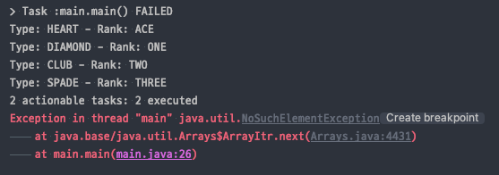
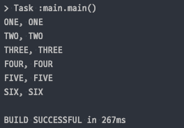

## 전통적인 for 문보다는 for-each 문을 사용하라

### 컬렉션/배열 순회

```java

// some list
List<String> list = new ArrayList<>();

// 컬렉션 순회 - for loop
for (Iterator<String> iterator = list.iterator(); i.hasNext(); ) {
    String element = iterator.next();
    ... // do something
}

// 컬렉션 순회 - while loop
Iterator<String> iterator = list.iterator();
while (iterator.hasNext()) {
    String element = iterator.next();
    // do something
}

// 배열 순회
String[] arr = new String[]{"a", "b", "c"};
for (int i = 0; i < arr.length; i++) {
     // do something
}
```
**단점 :**  
- 반복자(iterator)나 인덱스 탐색을 위한 변수들은 코드를 지저분하게 만들며 실제로 필요한 원소(element)를 위한 부수적인 코드이다. 
- 쓰이는 요소 종류가 늘어나면 잘못된 변수 사용으로 인해 예상치 못한 오류를 맞딱드릴 확률이 높아진다. 
- 또한 컬렉션이냐 배열이냐에 따라 코드 형태가 달라지므로 주의를 요구한다.

---
### for each
- 향상된 for 문 (Enhanced for statement)
- 반복자와 인덱스 변수를 사용하지 않아 코드가 깔끔해지고 오류가 날 일도 없다
- 공통된 관용구로 컬렉션, 배열 모두 처리가 가능해 어떤 컨테이너를 다루는지 신경 쓰지 않아도 된다

```java
for (Element e : elements) {
    // e로 무언가를 한다.
}
```
- 해당 반복문은 "`elements`안의 각 원소 `e`에 대해"라고 읽는다.
    - 콜론(:)은 "안의(in)"을 의미
- `for-each`문이 만들어내는 코드는 사람이 손으로 최적화 한 것과 사실상 같기 때문에 반복 대상이 컬렉션이든 배열이든, `for-each`문을 사용해도 속도는 그대로이다
---
### 반복문 중첩 순회
- 중첩 순회시 `for-each`의 이점은 더욱 커진다

#### 반복문 중첩시 흔한 실수

- 실수 예제 `outerCollection.size < innerCollection.size()`
  ```java
  enum Type {HEART, DIAMOND, CLUB, SPADE}
  enum Rank {ACE, ONE, TWO, THREE, FOUR, FIVE, SIX, SEVEN, EIGHT, NINE,TEN, JACK, QUEEN,KING}

  static Collection<Type> types = Arrays.asList(Type.values());
  static Collection<Rank> ranks = Arrays.asList(Rank.values());

  List<Card> deck = new ArrayList<>();
        
  for (Iterator<Type> i = types.iterator(); i.hasNext(); ) {
      for (Iterator<Rank> j = ranks.iterator(); j.hasNext(); ) {
          deck.add(new Card(i.next(), j.next()));
      }
  }
  ```
  - 여기서 문제는 바깥 컬렉션(types)의 반복자에서 next 메서드가 너무 많이 불린다는 점이다.
  - 마지막 줄의 i.next()가 `Type 하나당` 한번 씩 불려야 하는데, `Rank 하나당` 한번 씩 불리고 있다.
  - 하여 Type가 바닥나면 반복문에서 NoSuchElementException을 던진다.

    
- 더 심각한 예제
  - 운이 나빠서 바깥 컬렉션의 크기가 안쪽 컬렉션 크기의 배수라면? `outerCollection.size >= innerCollection.size()`
  - 주사위를 두 번 굴렸을 때 나올 수 있는 모든 경우의 수를 출력하는 코드
    ```java
    enum Face {ONE, TWO, THREE, FOUR, FIVE, SIX}
  
    Collection<Face> faces = EnumSet.allOf(Face.class);
    
    for(Iterator<Face> i = faces.iterator(); i.hasNext(); ) {
        for (Iterator<Face> j = faces.iterator(); j.hasNext(); ) {
            System.out.println(i.next() + ", " + j.next());
        }
    }
    ```
    - 예외도 던지지 않으며 원하는 일을 수행하지 않은 채 프로그램이 종료된다  


---

### 해결 방법과 for-each 사용
- for loop를 통한 해결 방법
  ```java
  for(Iterator<Face> i = faces.iterator(); i.hasNext(); ) {
      Face face = i.next(); // 바깥 반복문에 바깥 원소를 저장하는 변수를 추가
      for (Iterator<Face> j = faces.iterator(); j.hasNext(); ) {
          System.out.println(face + ", " + j.next());
      }
  }
  ```
  - 문제는 고쳤지만 보기 좋지 않다.
- for-each를 통한 해결 방법
  ```java
  for (Face firstFace : faces) {
      for (Face secondFace : faces) {
          System.out.println(firstFace + ", " + secondFace);
      }
  }
  ```
  - for-each문을 중첩하는 것으로 더욱 간단하게 해결 가능하며 코드도 간결해진다.
---
### for-each문을 사용할 수 없는 세 가지 상황

1. **파괴적인 필터링(destructive filtering)** 
  - 컬렉션을 순회하며 선택된 원소를 제거해야 한다면 반복자의 remove 메서드를 호출해야 한다.
  - 자바8부터 Collection의 removeIf 메서드를 사용해 컬렉션을 명시적으로 순회하는 일을 피할 수 있다
    - 예시
      ```java
      List<CardNo> cardNos = new ArrayList<>();
      cardNos.add(new CardNo(1));
      cardNos.add(new CardNo(2));
      cardNos.add(new CardNo(3));
      cardNos.add(new CardNo(4));
      
      for (CardNo cardNo : cardNos) {
          if (cardNo.number == 1) {
              cardNos.remove(cardNo);
          }
      }
      ```
      - 발생 오류  
      
      - 인텔리제이에서 `cardNos.removeIf(cardNo -> cardNo.number == 1);`로 바꾸도록 권장하고 있음
2. **변형(transformation)**
  - 리스트나 배열을 순회하면서 그 원소의 값 일부 혹은 전체를 교체해야 한다면 리스트의 반복자나 배열의 인덱스를 사용해야 한다.
    - 예시
      ```java
          for (CardNo cardNo : cardNos) {
              if (cardNo.number == 1) {
                  cardNo = new CardNo(10);
              }
          }
          System.out.println("for-each = " + toNumbers(cardNos)); // 변경이 되지 않음
  
          for (int i = 0; i < cardNos.size(); i++) {
              if (cardNos.get(i).number == 1) {
                  cardNos.set(i, new CardNo(10));
              }
          }
          System.out.println("for loop = " + toNumbers(cardNos)); // 변경됨
      ```  
      
3. **병렬 반복(parallel iteration)**
  - 여러 컬렉션을 병렬로 순회해야 한다면 각각의 반복자와 인덱스 변수를 사용해 엄격하고 명시적으로 제어해야 한다 (앞선 Type와 Rank의 상황과 비슷하다)
    ```java
    private Set<String> one;
    private Set<String> two;
  
    public void run(){
        for (Iterator<String> iterOne=one.iterator(),Iterator<String> iterTwo=two.iterator(); iterOne.hasNext() && iterTwo.hasNext(); ) {
            // do something with iterOne.next() and iterTwo.next()
        }
    }
    ```

### Iterable 인터페이스
- for-each문을 사용하면 컬렉션과 배열은 물론 Iterable 인터페이스를 구현한 객체라면 무엇이든 순회할 수 있다
```java
// Iterable 인터페이스
public interface Iterable<E> {
    // 이 객체의 원소들을 순회하는 반복자를 반환한다.
    Iterator<E> iterator();
}
```
- 처음부터 직접 구현하기는 까다롭지만, 원소들의 묶음을 표현하는 타입을 작성해야 한다면 Iterable을 구현하는 쪽으로 고민해봐야 한다.
- 해당 타입에서 Collection 인터페이스는 구현하지 않기도 했더라도 Iterable을 구현해두면 그 타입을 사용하는 프로그래머가 for-each문을 유용하게 사용할 것이다.
